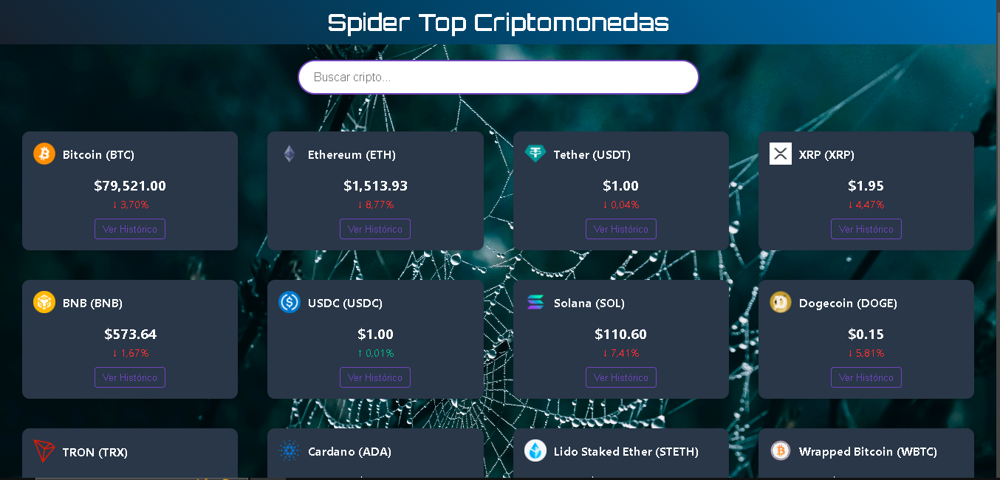

# 🕷️ Spider Top Cryptomonedas 🚀

[](https://reactjs.org/)
[](https://www.chartjs.org/)
[](https://www.coingecko.com/)

Aplicación web que muestra los precios de las principales criptomonedas (Bitcoin, Ethereum, etc.) con gráficos.

![Captura de Pantalla]


## 🌟 Características
- Precios en tiempo real (o actualizados periódicamente) de +10 criptomonedas.
- Gráficos históricos (PriceChart) para visualizar tendencias.
- Diseño responsive con tarjetas interactivas (CryptoCard).

## 🛠 Tecnologías
- **Frontend**: React.js, CSS.
- **Gráficos**: Chart.js
- **API**: CoinGecko, CoinMarketCap, o propia.

## 📦 Instalación
1. Clona el repositorio:
   ```bash
   git clone https://github.com/Marxianfriedman/mi-app-letal.git